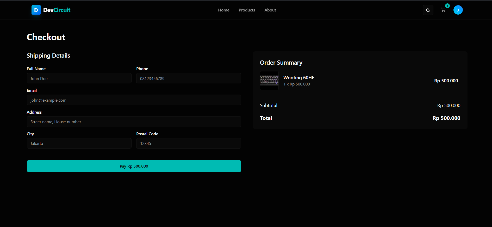
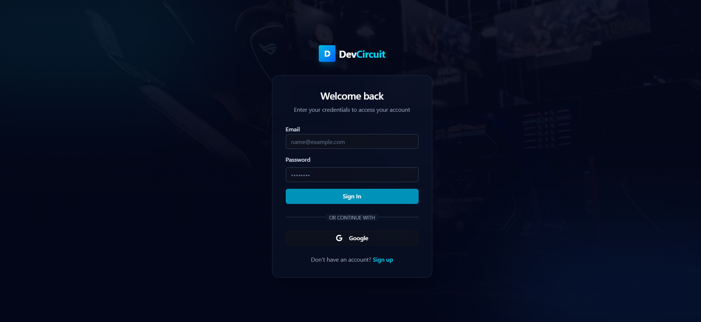
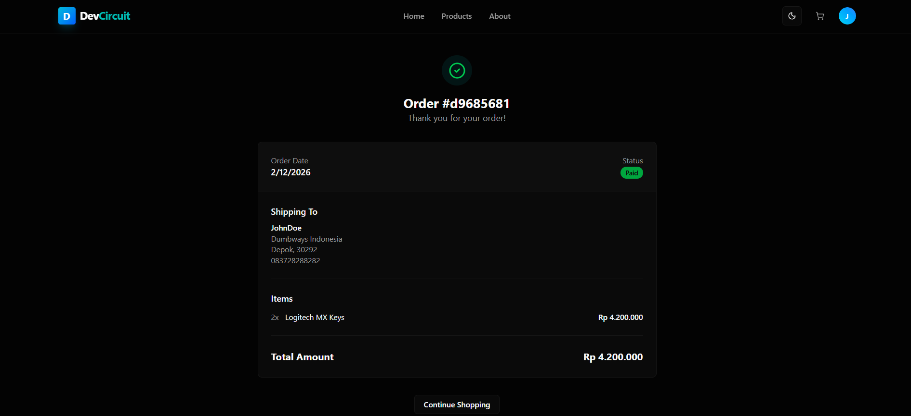

# DevCircuit - Premium Tech Store 🛍️

A state-of-the-art e-commerce application built for developers and tech enthusiasts. **DevCircuit** offers a seamless shopping experience with real-time stock updates, secure payments via Midtrans, and a powerful admin dashboard.


## 🚀 Key Features

### 🛒 Customer Experience
*   **Real-time Stock**: View live product availability. "Add to Cart" buttons update instantly if someone else buys the last item.
*   **Seamless Cart**: Persistent shopping cart with "Add More" feedback and quantity controls.
*   **Secure Checkout**: Integrated **Midtrans** payment gateway for secure credit card and QRIS transactions.
*   **Order Tracking**: Track order status from "Pending" to "Shipped" with real-time updates.
*   **Smart Search**: Filter products by category, search by name, and sort by price or date.

### 🛡️ Admin Dashboard
*   **Product Management**: Full CRUD capabilities for products with image upload support.
*   **Order Command Center**: View all orders, filter by status, and manage lifecycles (Approve, Ship, Cancel).
*   **Real-time Insights**: See new orders pop up instantly without refreshing the page.
*   **Secure Access**: Role-based protection ensures only admins can access sensitive tools.

## 🛠️ Tech Stack

Built with the latest Next.js 14 stack for performance and scalability.

*   **Framework**: [Next.js 14](https://nextjs.org/) (App Router, Server Actions)
*   **Database**: [Supabase](https://supabase.com/) (PostgreSQL + Realtime Subscriptions)
*   **Styling**: [Tailwind CSS](https://tailwindcss.com/) + [Shadcn UI](https://ui.shadcn.com/) (Radix Primitives)
*   **State Management**: [Zustand](https://github.com/pmndrs/zustand) (Client-side & Persist)
*   **Payment Gateway**: [Midtrans](https://midtrans.com/) (Snap Integration)
*   **Email**: [Resend](https://resend.com/) + [React Email](https://react.email/)

## 📸 Screenshots

| Landing Page | Products |
|:---:|:---:|
|  |  |
| *Immersive Homepage* | *Browse Categories & Products* |

| Product Detail & Cart | Checkout |
|:---:|:---:|
|  |  |
| *Add to Cart & View Details* | *Secure Checkout with Snap* |

| Admin Dashboard (Orders) | Customer Orders |
|:---:|:---:|
|  |  |
| *Manage Orders & Statuses* | *Track Order History* |

| Authentication | Order Success |
|:---:|:---:|
|  |  |
| *Secure Login* | *Order Confirmation* |

## ⚙️ Setup & Installation

Follow these steps to run DevCircuit locally.

### 1. Clone the repository
```bash
git clone https://github.com/Riza-FP/DevCircuit.git
cd quickshop
```

### 2. Install dependencies
```bash
npm install
```

### 3. Environment Variables
Copy the example environment file and fill in your credentials.
```bash
cp .env.example .env.local
```

You will need credentials for:
*   **Supabase**: `NEXT_PUBLIC_SUPABASE_URL`, `NEXT_PUBLIC_SUPABASE_ANON_KEY`, `SUPABASE_SERVICE_ROLE_KEY`
*   **Midtrans**: `NEXT_PUBLIC_MIDTRANS_CLIENT_KEY`, `MIDTRANS_SERVER_KEY`
*   **Resend**: `RESEND_API_KEY`

### 4. Database Setup (Supabase)
1.  Create a new Supabase project.
2.  Run the migration scripts located in `database/` (or use the provided SQL dumps).
3.  **Enable Realtime**: Go to Database -> Replication and enable it for `products` and `orders`.
4.  **Storage**: Create a public bucket named `products`.

### 5. Run the development server
```bash
npm run dev
```
Open [http://localhost:3000](http://localhost:3000) to view the app.

## 📦 Deployment

This project is optimized for deployment on **Vercel**.

1.  Push your code to GitHub.
2.  Import the project into Vercel.
3.  Add all environment variables from `.env.local` to Vercel's project settings.
4.  Deploy!

## 📝 License

This project is open source and available under the [MIT License](LICENSE).
